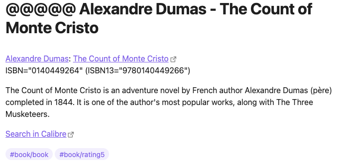
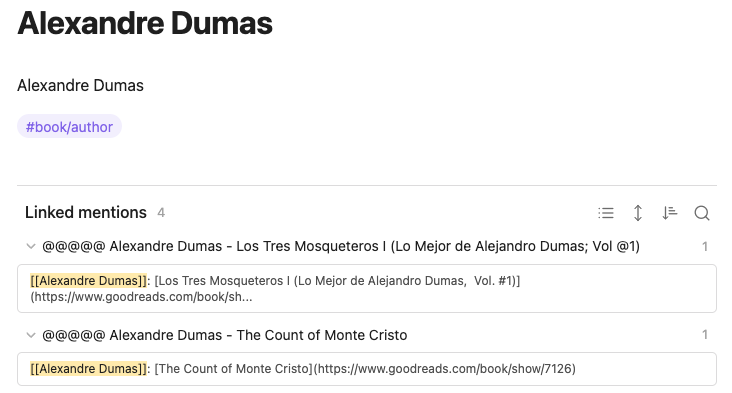

# Goodreads export to markdown files

Export your goodreads book reviews into markdown files.
Also creates author markdown files connected to the review.

In review files there are also links to the goodreads' book page and
[Calibre](https://calibre-ebook.com/) URL to search
for this book in your local Calibre collection.

The application add tags based on your `shelves`.

This is how that looks like in [Obsidian](https://obsidian.md/):

### How to create goodreads export file

This application use CSV file created on goodreads.com.
How to create goodreads export see in https://www.goodreads.com/review/import

In 2022 they declared the export feature to be removed by August 2020, but at least at the beginning of
2023 it still works.

In fact I created the application as one-time solution to go away from goodreads with
my 600-something book reviews. But as it still works now I use it also to incrementally update my
markdown files in Obsidian.

### Why this lame approach with manually exported file

Goodreads at 2020 had stopped giving out API keys.

So it's all about making lemonade out of lemons.

I cannot not use the API to fully automate the process,
but at least I can still get my data from goodreads.

Unfortunately with this manual export step included.

### Incremental updates

Application can add reviews to already existed files.

It reads files from the folders and won't create reviews that are already there.
This is possible because there are goodreads book ID in the markdown files - inside link to goodreads.

So even if you rename the file the application still know what book it is about thanks to the
goodreads link inside the file. This links created by the application and all you have to do
just do not delete or modify them.

#### Author files

Unfortunately there are no author ID in the goodreads export file.

Despite that the application add to author files link for search on goodreads, with the author
name inside the link.

So if you just rename the file, application still will know the original
author name from the link.
Of cause you should not delete or modify the link.

If you read non-English authors, there are could be a lot of different spellings of the author name
in different books on goodreads. They have a huge amount of "different" authors that in reality
just different spelling of the same author.

In this case you could want to have just one author file.

If you aggregate a number of author files you should copy to the aggregated author file all search
links from author files that are aggregated into this one.

Application will extract all author name "synonyms" from these links.

### Installation

    pip install goodreads-export

It will install Linux or Windows script `goodreads-export`.

### Usage

    $> goodreads-export --help

    Usage: goodreads-export [OPTIONS] [CSV_FILE]

      Convert reviews and authors from goodreads export CSV file to markdown
      files.

      For example you can create nice structure in Obsidian.

      How to create goodreads export see in
      https://www.goodreads.com/review/import In 2022 they declare it to be
      removed by August, but at least at the end of 2022 it still works.

      CSV_FILE: Goodreads export file. By default `goodreads_library_export.csv`.

    Options:
      -o, --out PATH  Folder where we put result. By default current folder.
      --help          Show this message and exit.

If we run in the folder with goodreads export file (goodreads_library_export.csv) the
script without parameters, like that

    goodreads-export

It will create in this folder subfolders `reviws`, `toread`, `authors` with the md-files.
If you copy them into Obsidian vault, the files will be inside your Obsidian knowledgebase.

# source code

[sorokin.engineer/aios3](https://github.com/andgineer/goodreads-export)
