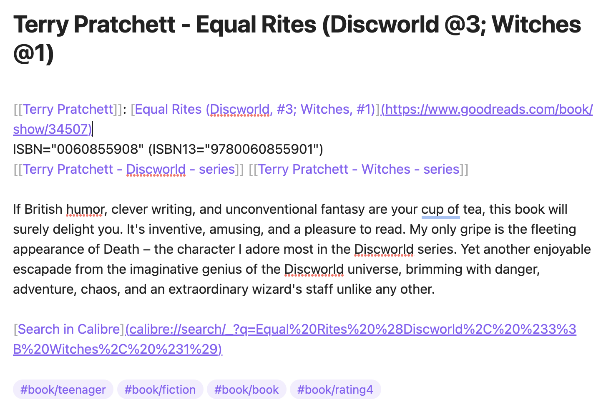
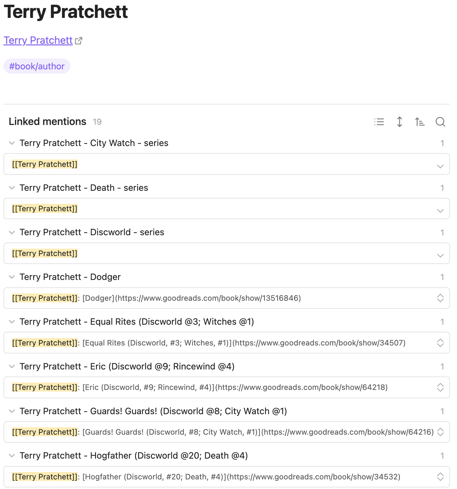

# Goodreads export to markdown files

Transform your Goodreads book reviews into structured markdown files, 
ideal for use in [Obsidian](https://obsidian.md/) and other markdown-based applications.

- **Goodreads Book Page Links:** Each markdown file contains a direct link to the corresponding book's page on Goodreads.
- **Calibre Integration:** Includes a [Calibre](https://calibre-ebook.com/) URL for each book, allowing quick searches 
in your local Calibre collection.
- **Tagging Based on Goodreads Shelves:** Reviews are automatically categorized with tags derived from your Goodreads shelves.
- **Customizable Templates:** Utilizing Jinja2 templates, the output format can be easily customized to suit your specific needs or preferences.

??? note "Example of book review in Obsidian"
    

??? note "Example of book author in Obsidian"
    

??? note "Example of book series in Obsidian"
    

## Installation
Install using [`pipx`](https://pypa.github.io/pipx/) for isolated environments, which prevents interference 
with your system's Python packages:

=== "MacOS"
    ```bash
    brew install pipx
    pipx ensurepath
    ```

=== "Linux"
    ```bash
    python3 -m pip install --user pipx
    python3 -m pipx ensurepath
    ```

=== "Windows"
    ```bash
    # If you installed python using the app-store, replace `python` with `python3` in the next line.
    python -m pip install --user pipx
    ```

**Final Step**: Once `pipx` is set up, install `goodreads-export`:

```bash
pipx install goodreads-export
```

## How to Create a Goodreads Export File

This application utilizes a CSV file generated from goodreads.com. 
To create your Goodreads export, follow the instructions at [Goodreads Book Export](https://www.goodreads.com/review/import).

Despite announcements in 2022 about the removal of this feature by August 2020, 
the export function was still operational as of late 2023.

Initially, I developed this application as a one-off solution to migrate my 700+ book reviews away from Goodreads. 
However, since the export feature remains functional, I now use it to incrementally update my markdown files in Obsidian.

### Why Use a Manually Exported File?

As of 2020, Goodreads discontinued issuing new API keys. 
Consequently, my approach is about adapting to these limitations.

While I can't fully automate the process due to the API restriction, I can still retrieve my data from Goodreads, 
albeit with the additional step of manual export.

## Incremental Updates, Merge Authors

The application supports adding reviews to a folder with existing files. 
It reads the existing files and avoids creating duplicates by using the Goodreads book IDs embedded 
in the markdown file links to Goodreads pages.

**Important:** To maintain the integrity of the data, do not remove or modify these Goodreads links. 
The application uses these links, not the file names, to identify the books.

### Author Files

The links within the files serve as author IDs and should not be altered. 
The author's name is sourced from the link within each file, rather than from the file's name.

### Merging Different Author Names

Goodreads may have various spellings or language versions of an author's name. 
This application allows for merging these into a single 'primary' author file.

- Consolidate all author names by copying their links into one primary author file.
- Ensure the first link in this file is the 'primary' name of the author.
- To merge author names without importing new data from Goodreads, use the `--merge` option. 
This will only perform the merging of author names, eliminating the necessity to specify a Goodreads export file.

## Command Line Interface
??? note "goodreads-export --help"
    

??? note "goodreads-export import --help"
    

If the script is executed in a directory containing the Goodreads export file (`goodreads_library_export.csv`) 
without any parameters, as follows:

    goodreads-export import .

This command will generate subfolders within the current directory: `reviews`, `toread`, and `authors`, 
each populated with corresponding markdown files. 

Alternatively, you can specify a direct path to a folder within your Obsidian vault where your books are organized, 
and the application will update that location.

### Templates

This application utilizes [Jinja templates](https://jinja.palletsprojects.com/en/latest/), which are fully customizable. 
To begin customizing, use the `init` command to copy built-in templates into your `BOOKS_FOLDER`. 
You can then modify these templates as needed.

The templates include:

- `author.jinja` for generating author files.
- `book.jinja` for creating book files.
- `series.jinja` for series files.

Additionally, `regex.toml` contains specified regexes to extract data from these files.
